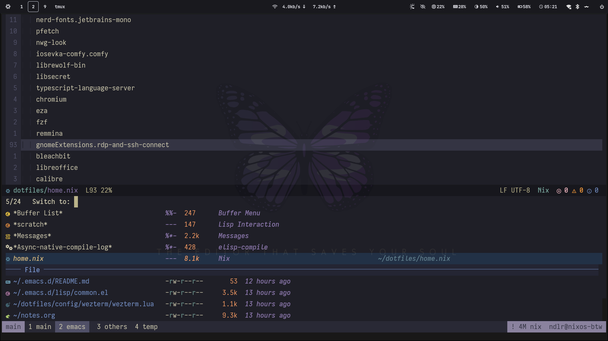
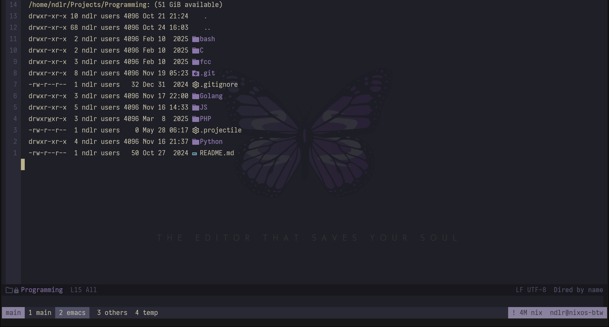
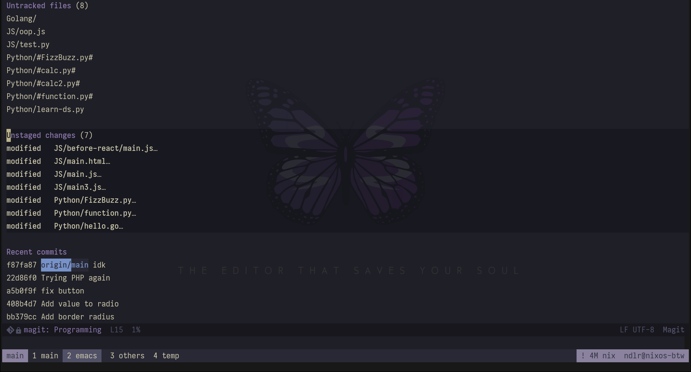
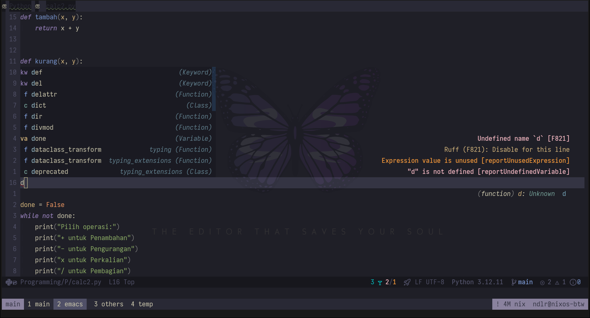
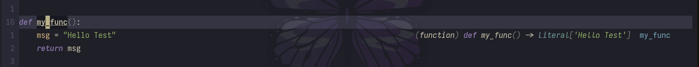

# Emacs Configuration

Trying emacs from scratch :).

## Screenshot

Buffer Switch:

Dired:

`M-x`:

Magit:

LSP & code completion:

Code documentation:

- Yap, I'm not using `README.org` rn.

## Roadmap

- [ ] Add documentation workflow
